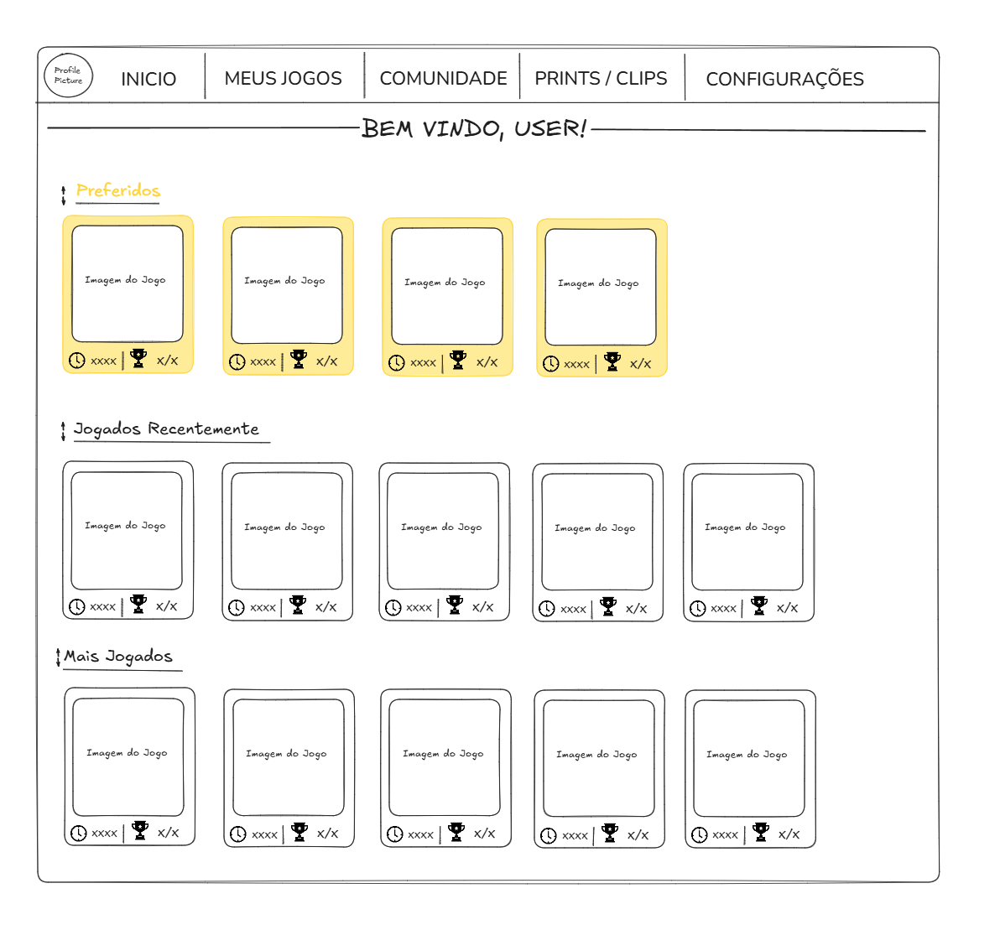
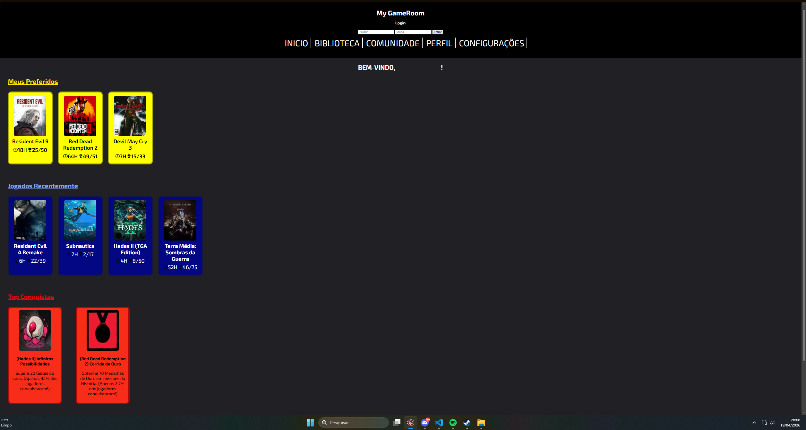

# Trabalho Prático - Semana 04

Dessa vez, vamos escolher uma proposta de projeto para trabalhar.

Nessa atividade, você deverá montar a página inicial do projeto escolhido, a organização do HTML aplicando semântica correta e uso aprimorado do CSS. Leia o enunciado completo no Canvas para mais detalhes.

**IMPORTANTE:** Você deve trabalhar e alterar apenas arquivos dentro da pasta **`public`**. Deixe todos os demais arquivos e pastas desse repositório inalterados. **PRESTE MUITA ATENÇÃO NISSO.**

## Informações Gerais

- Nome: Kaique Rodrigues do Vale
- Matricula: 913328
- Proposta de projeto escolhida: 4.Coleção e Itens = Biblioteca de Jogos
- Breve descrição sobre seu projeto: Estou criando uma biblioteca de jogos em formato web, onde organizo os jogos em cards com imagem, título, horas jogadas e conquistas. O objetivo é ter um catálogo visual simples e interativo para facilitar a visualização e o controle dos jogos, evoluindo o projeto aos poucos com novas funcionalidades e melhorias de interface. Também pretendo adicionar um fórum de comunidade, onde os usuários poderão interagir, compartilhar opiniões e discutir sobre os jogos.

## Print do(s) wireframe(s) criado
> Sugestão, use o Excalidraw para isso. Utilize esse [template básico](https://excalidraw.com/#json=LU-8hwcQEwzk11FwO8Opo,qPU9K6cNUEzlXzwOuKMIlQ) para você começar. 

## Print da home-page criada

